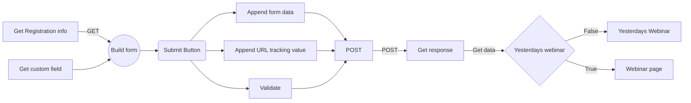

# Stealth Seminar API Registration form

Registration form using [StealthSeminar](https://stealthseminar.com/) API with advanced **date filtering** and almost all available options. This form is by default dynamic. That's mean all fields (with custom fields, DateTime locale and formatting) will be configured automatically, and you are allowed to add more custom fields including hidden field. **You are not forced to follow this process, you can do whatever you want.**

## Features

- Advance date filtering (**Year, Month, Day, Date, Meridiem**)
- Show yesterdays webinar now
- Dynamic time format (**with locale**)
- Dynamic fields
- Custom fields
- Hidden fields
- URL tracking value (v1, v2 etc)

## Usage

Edit app.js file to configure form

#### Replace short id

```javascript
// Webinar id
const webinarShortId = "";
```

#### Change initial country

```javascript
// initial country
const initialCountry = "us";
```

#### Enable field forcefully

If Name, [GDPR consent](https://help.stealthseminarapp.com/en/articles/2802189-gdpr-support), SMS alert, Country fields are disabled on event settings, And if you want you enable only in API you can enable that field forcefully. **Please Note** that forcefully fields are mark as _required_ by default, but you are allowed to change this behavior.

```javascript
// Set field = true to enable forcefully
const fields = {
  name: false,
  gdprConsent: false,
  smsAlert: false,
  country: false,
};

//...

// Handle forcefully field

// Set parameter false instead of true to mark as optional
if (fields.name) showName(true);
if (fields.gdprConsent) showGDPR(true);
if (fields.smsAlert) showSMSAlert(true);
if (fields.country) showCountry(true);
```

#### Add custom field or hidden field

[Custom field](https://help.stealthseminarapp.com/en/articles/2919199-how-do-i-add-custom-field-to-my-registration-page), that already added in main form will automatically added in this form. To add more field in this form, follow this

```javascript
// Find addCustomFields function and call these function to add custom field
function addCustomFields() {
  customTextField("name", "label", true); // Text field
  customSelectField(
    "name",
    "label",
    [{ label: "label", value: "value" }],
    true
  ); // Select

  customCheckboxField(
    "name",
    "label",
    [{ label: "label", value: "value" }],
    true
  ); // checkbox

  customRadioField("name", "label", [{ label: "label", value: "value" }], true); // radio
  customHiddenField("name", "value"); // Hidden
  //* Call function n time to get n number of custom field // where n is a Number
}

// Inside file you will get more info
```

#### Enable or Disable date filter

All filter options are enabled by default, to disable filter options set false instead of true

```javascript
// Date filter
const dateFilter = {
  year: true,
  month: true,
  date: true,
  day: true,
  meridiem: true,
};
```

#### Remove formatted part from final date

By default this option is turned off. To enable set options to true

```javascript
// Handlers
const handler = {
  // ...
  removeFiltered: false, // ex: Remove AM from date if user selected AM in filtering and same for all available formatting options
};
```

## Debug

#### Form loading problem

Find this code and **uncomment** error marked line

```javascript
axios
    .get(//...)
    //...
    .catch((e) => {
    // console.log(e); // Error
    // ...
    })
```

#### Form submitting problem

Find submit function and **uncomment** error marked line

```javascript
function  submit(e) {
//...
axios
    .post(//..)
    //...
    .catch((e) => {
    // console.log(e); // Error
    // ...
    })
```

## Process

This is not the only process, you can do whatever you want



## FAQ

#### How do I find short id?

https://help.stealthseminarapp.com/en/articles/3362881-how-do-i-find-the-shortid-for-my-event
